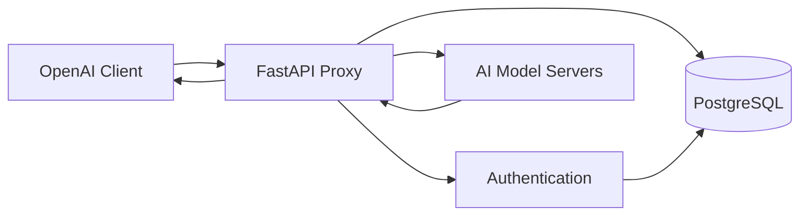

# My OpenAI Frontend

A proxy server to enhance OpenAI compatible frontend for Triton Inference Server. This project provides an OpenAI API-compatible interface for Triton Inference Server, enhancing it with authentication, logging, usage tracking, and user management capabilities.

> ⚠️ **IMPORTANT DISCLAIMER:** This project is for **LEARNING AND EDUCATIONAL PURPOSES ONLY**. It is **NOT intended for production use**. The code may contain security vulnerabilities, lacks proper error handling, and should not be deployed in production environments without significant additional work and security hardening.

> **Note:** This project is currently under construction and is an AI-assisted (GitHub Copilot) development project for educational exploration.

## Features

### 🔐 Authentication & Authorization
- **OAuth2 Compliance**: Full OAuth2 implementation with JWT tokens
- **API Key Management**: Secure API key generation and validation
- **Scope-Based Access Control**: Fine-grained permissions for different services
- **User Management**: Complete user lifecycle with registration, authentication, and profile management
- **Admin Interface**: Administrative endpoints for user and system management

### 🤖 OpenAI API Compatibility
- **Chat Completions**: Full OpenAI Chat Completions API with streaming support
- **Text Embeddings**: OpenAI-compatible embedding generation
- **Audio Transcription**: Speech-to-text conversion with file upload support
- **Model Management**: Dynamic model discovery and capability-based filtering
- **Multi-Modal Support**: Text, image, audio, and file content types

### 📊 Usage Tracking & Analytics
- **Comprehensive Logging**: Detailed usage statistics and token consumption tracking
- **Real-Time Analytics**: User and admin dashboards for usage monitoring
- **Cost Estimation**: Built-in cost calculation and reporting
- **Performance Metrics**: Request latency and throughput monitoring

### 🏗️ Robust Architecture
- **PostgreSQL Integration**: Persistent storage for users, tokens, and usage data
- **Configurable Logging**: Multi-backend logging with database and console support
- **Error Handling**: Comprehensive error handling with proper HTTP status codes
- **Dependency Injection**: Clean architecture with testable components
- **Docker Support**: Containerized deployment with Docker Compose

### 🚀 Performance & Scalability
- **Asynchronous Processing**: Non-blocking request handling with FastAPI
- **Streaming Support**: Real-time streaming for chat completions
- **Connection Pooling**: Efficient database connection management
- **Batch Processing**: Optimized batch operations for usage logging

## Quick Start

### Prerequisites
- Docker and Docker Compose
- Python 3.10+ (for local development)
- PostgreSQL 12+ (if running without Docker)

### Using Docker Compose (Recommended)

1. **Clone the repository**
   ```bash
   git clone <repository-url>
   cd my-openai-frontend
   ```

2. **Configure the application**
   ```bash
   # Copy and edit the configuration file
   cp asset/config-old.yml asset/config.yml
   # Edit asset/config.yml with your database and model settings
   ```

3. **Start the services**
   ```bash
   # Start PostgreSQL and the application
   docker-compose -f docker-compose.dev.yml up -d
   ```

4. **Verify the installation**
   ```bash
   # Check if services are running
   curl http://localhost:8000/health
   
   # List available models (requires authentication)
   curl -H "Authorization: Bearer <your-api-key>" \
        http://localhost:8000/v1/models
   ```

### Local Development Setup

1. **Install dependencies**
   ```bash
   pip install -r requirements.txt
   ```

2. **Set up the database**
   ```bash
   # Ensure PostgreSQL is running and create database
   createdb ai_platform_auth
   ```

3. **Configure the application**
   ```bash
   # Edit asset/config.yml with your local settings
   nano asset/config.yml
   ```

4. **Run the application**
   ```bash
   python src/main.py
   ```

### First Steps

1. **Create an account and get API key**
   ```bash
   # Login with default admin credentials (change password after first login!)
   curl -X POST http://localhost:8000/user/login \
        -H "Content-Type: application/x-www-form-urlencoded" \
        -d "username=admin&password=change-this-password"
   
   # Extract access_token from response and create an API key
   curl -X POST http://localhost:8000/apikey \
        -H "Authorization: Bearer <access-token>"
   ```

2. **Test chat completion**
   ```bash
   curl -X POST http://localhost:8000/v1/chat/completions \
        -H "Authorization: Bearer <api-key>" \
        -H "Content-Type: application/json" \
        -d '{
          "model": "llama-3.3-70b-instruct",
          "messages": [{"role": "user", "content": "Hello!"}],
          "max_tokens": 50
        }'
   ```

3. **Generate embeddings**
   ```bash
   curl -X POST http://localhost:8000/v1/embeddings \
        -H "Authorization: Bearer <api-key>" \
        -H "Content-Type: application/json" \
        -d '{
          "model": "nv-embed-v2",
          "input": "Hello world"
        }'
   ```

## API Endpoints

### Authentication
- `POST /user/login` - User authentication
- `GET /auth/` - Token validation
- `POST /auth/refresh` - Refresh access token
- `POST /apikey` - Create API key

### OpenAI Compatible
- `GET /v1/models` - List available models
- `POST /v1/chat/completions` - Chat completions (with streaming)
- `POST /v1/embeddings` - Generate embeddings
- `POST /v1/audio/transcriptions` - Audio transcription

### User Management
- `GET /user/` - Get current user info
- `PUT /user/` - Update user profile
- `GET /user/scopes` - List available scopes

### Usage Analytics
- `GET /usage/{time}` - Get usage statistics
- `GET /admin/usage/summary` - System usage summary (admin only)

## Documentation

### Module Documentation
- [📝 APIKEY Module](doc/APIKEY_MODULE.md) - API key management and validation
- [⚙️ CONFIG Module](doc/CONFIG_MODULE.md) - Configuration management system
- [📋 LOGGER Module](doc/LOGGER_MODULE.md) - Comprehensive logging system
- [👥 OAUTH2 Module](doc/OAUTH2_MODULE.md) - Authentication and user management
- [🤖 OPENAIAPI Module](doc/OPENAIAPI_MODULE.md) - OpenAI-compatible API implementation
- [📊 USAGE Module](doc/USAGE_MODULE.md) - Usage tracking and analytics

### API Reference
- **OpenAI Compatibility**: Full compatibility with OpenAI Python SDK and client libraries
- **Authentication**: Bearer token authentication with scope-based authorization
- **Error Handling**: Standard HTTP status codes with detailed error messages
- **Rate Limiting**: Configurable rate limits per user and API key

## Configuration

The application uses YAML configuration files located in the `asset/` directory:

```yaml
# OAuth2 Authentication
oauth2:
  enable: true
  secret_key: "your-secret-key-here"  # Generate a secure random key
  algorithm: "HS256"
  access_token_expire_time: 3600  # 1 hour
  refresh_token_expire_time: 2592000  # 30 days
  default_admin:
    username: "admin"
    email: "admin@yourdomain.com"
    full_name: "System Administrator"
    password: "change-this-password"  # Change this immediately!
  
# Database Configuration
database:
  host: "postgres"  # Use "localhost" for local development
  port: 5432
  username: "your-db-username"
  password: "your-secure-db-password"
  database: "ai_platform_auth"
  table_prefix: "myopenaiapi"
  
# Logging Configuration
logging:
  level: "INFO"  # DEBUG, INFO, WARNING, ERROR, CRITICAL
  database:
    enabled: true
    retention_days: 365
  console:
    enabled: true
    format: "%(asctime)s - %(name)s - %(levelname)s - %(message)s"
  components:
    authentication: "INFO"
    database: "INFO"
    models: "INFO"
  
# Model Configuration
models:
  llama-3.3-70b-instruct:
    host: "your-model-server-ip"
    port: 8001
    type: ["chat:base"]
    response:
      id: "llama-3.3-70b-instruct"
      created: 1749095099
      object: "model"
      owned_by: "your-organization"
  nv-embed-v2:
    host: "your-embedding-server-ip"
    port: 9001
    type: ["embeddings:base"]
    args:
      instruction: "Given a question, retrieve passages that answer the question."
    response:
      id: "nvidia/nv-embed-v2"
      created: 1749095099
      object: "model"
      owned_by: "your-organization"
  whisper-large-v3-turbo:
    host: "your-audio-server-ip"
    port: 8001
    type: ["audio:transcription"]
    response:
      id: "openai/whisper-large-v3-turbo"
      created: 1749095099
      object: "model"
      owned_by: "your-organization"
```

### Security Configuration Notes

⚠️ **Important Security Settings:**
- **Change default admin password** immediately after first deployment
- **Generate a strong secret key** for JWT token signing (use `openssl rand -hex 32`)
- **Use environment variables** for sensitive data in production
- **Enable HTTPS** in production deployments
- **Configure firewall rules** to restrict database and model server access


## Architecture

This project acts as a learning-focused proxy between OpenAI-compatible clients and AI model servers.



### Core Components

1. **FastAPI Proxy**: Receives OpenAI-compatible requests and routes them
2. **Authentication**: Manages users, API keys, and access control
3. **PostgreSQL Database**: Stores user data and usage logs
4. **AI Model Servers**: External servers hosting LLaMA, embedding, and audio models

### Simple Request Flow

1. Client sends OpenAI-compatible request
2. Proxy validates API key/token
3. Request forwarded to appropriate model server
4. Response formatted and returned to client
5. Usage logged to database

## Contributing

This project is primarily for learning purposes, but contributions are welcome! 

### Development Guidelines

1. **Fork the repository** and create a feature branch
2. **Follow coding standards** - Use type hints and docstrings
3. **Add tests** for new functionality
4. **Update documentation** for any API changes
5. **Submit a pull request** with a clear description

### Development Setup

```bash
# Install development dependencies
pip install -r requirements.txt
pip install -r requirements-dev.txt  # If available

# Run tests
python -m pytest tests/

# Run linting
flake8 src/
black src/

# Run type checking
mypy src/
```

### Code Structure

- **src/**: Main application code
- **tests/**: Unit and integration tests
- **doc/**: Module documentation
- **asset/**: Configuration files
- **docker/**: Docker configuration

## Security Considerations

🔒 **Production Security Checklist:**

- [ ] Change all default passwords and secret keys
- [ ] Enable HTTPS with valid SSL certificates
- [ ] Configure firewall rules for database and model servers
- [ ] Use environment variables for sensitive configuration
- [ ] Enable PostgreSQL SSL connections
- [ ] Set up proper logging and monitoring
- [ ] Configure rate limiting and request size limits
- [ ] Regular security updates and dependency scanning
- [ ] Backup and disaster recovery procedures

## Monitoring and Health Checks

- **Health Endpoint**: `GET /health` - Application health status
- **Metrics**: Integration with Prometheus/Grafana (if configured)
- **Log Monitoring**: Centralized logging with ELK stack or similar
- **Database Monitoring**: PostgreSQL performance and connection monitoring

## Troubleshooting

### Common Issues

**Database Connection Errors**
```bash
# Check PostgreSQL status
docker-compose logs postgres

# Test database connection
psql -h localhost -U your-username -d ai_platform_auth
```

**Model Server Connectivity**
```bash
# Test model server health
curl http://your-model-server-ip:8001/health

# Check model configurations
curl -H "Authorization: Bearer <api-key>" \
     http://localhost:8000/v1/models
```

**Authentication Issues**
```bash
# Verify JWT token
curl -H "Authorization: Bearer <token>" \
     http://localhost:8000/auth/

# Check user scopes
curl -H "Authorization: Bearer <token>" \
     http://localhost:8000/user/scopes
```

## License

This project is for educational purposes. Please respect the licenses of all dependencies.

**Dependencies:**
- FastAPI (MIT License)
- PostgreSQL (PostgreSQL License)
- PyJWT (MIT License)
- Pydantic (MIT License)
- Other dependencies as listed in requirements.txt

## Contact

[](https://www.linkedin.com/in/hohuihsieh)
[](mailto:billhsies@gmail.com)

**Developer**: Ho-Hui Hsieh  
**Project Type**: Learning & Development  
**Tech Stack**: FastAPI, PostgreSQL, Docker, OpenAI API