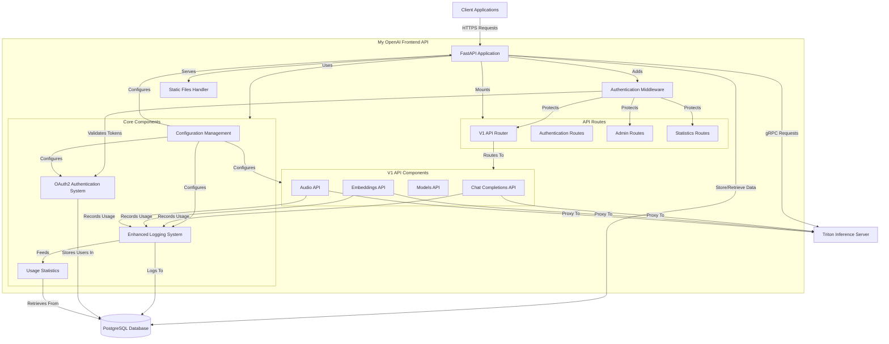

<!-- filepath: /workspace/doc/SYSTEM_CONTEXT_DIAGRAM.md -->
# System Context Diagram (SCD)

This document provides a visual representation of the system architecture and component interactions for the My OpenAI Frontend API.

## Overview

The My OpenAI Frontend API serves as a proxy service between clients and Triton Inference Server, providing OpenAI-compatible API endpoints with additional features like OAuth2 authentication, usage tracking, and administrative controls.

## System Context Diagram

## Component Descriptions

### Core Components

1. **Configuration Management**
   - Loads settings from YAML files and environment variables
   - Provides validated configuration to all components
   - Supports different environments (development, production)

2. **Enhanced Logging System**
   - Structured logging with contextual information
   - Supports console, file, and database logging
   - Component-specific log levels
   - Includes UsageLogger for tracking API consumption

3. **OAuth2 Authentication System**
   - User authentication and token generation
   - Role-based access control with scopes
   - Admin user management capabilities
   - Token management (short-lived and long-lived tokens)

4. **Usage Statistics**
   - Tracks API usage and token consumption
   - Provides usage reporting by user, time period, API type
   - Supports admin dashboards with summary statistics
   - Records recent activity for monitoring

### API Routes

1. **V1 API Router** (`/v1`)
   - Routes requests to appropriate API implementations
   - Maintains OpenAI API compatibility
   - Protected by authentication middleware
   - Aggregates models, chat, embeddings, and audio APIs

2. **Authentication Routes** (`/token`, `/users/me`, `/change-password`, etc.)
   - Handles login and token generation
   - User profile access
   - Token refresh mechanisms
   - Password management

3. **Admin Routes** (`/admin/*`)
   - User management (create, update, delete users)
   - Token generation and revocation for users
   - System statistics access

4. **Statistics Routes** (`/usage/*`)
   - User-specific usage statistics
   - Admin-level system-wide statistics
   - Time-period based aggregation (day, week, month)

### V1 API Components

1. **Chat Completions API** (`/v1/chat/completions`)
   - Processes chat completion requests
   - Supports streaming responses
   - Handles tool calling and function execution
   - Compatible with OpenAI Chat API

2. **Embeddings API** (`/v1/embeddings`)
   - Generates vector embeddings for text
   - Optimized for semantic search applications
   - Compatible with OpenAI Embeddings API

3. **Models API** (`/v1/models`)
   - Lists available models and capabilities
   - Provides model metadata
   - Compatible with OpenAI Models API

4. **Audio API** (`/v1/audio`)
   - Speech-to-text transcription
   - Text-to-speech generation
   - Compatible with OpenAI Audio API

### UI Components

1. **Static Files Handler**
   - Serves the web-based admin interface
   - Provides client-side JavaScript applications
   - Serves UI assets like CSS, JavaScript, and images
   - Redirects root endpoint to index.html

### External Systems

1. **Triton Inference Server**
   - Hosts and serves AI models
   - Receives inference requests from the proxy
   - Returns model outputs to the proxy
   - Handles parallel inference requests efficiently

2. **PostgreSQL Database**
   - Stores user accounts and authentication data
   - Records usage statistics and logs
   - Supports analytics and reporting
   - Maintains token refresh history

## Authentication Flow

1. Client requests token with credentials
2. Authentication system validates and issues token
3. Client includes token in subsequent API requests
4. Authentication middleware validates token before processing requests
5. API endpoints check specific scopes for authorization
6. Users can manage their credentials (change password) with appropriate authentication
7. Long-lived tokens can be refreshed before expiration
8. Admin can generate or revoke tokens for users

## Data Flow

1. Client sends API request with authentication token
2. Authentication middleware validates token
3. Request routed to appropriate API handler
4. API handler formats request for Triton server
5. Request forwarded to Triton Inference Server
6. Response received from Triton
7. Usage metrics logged to database
8. Formatted response returned to client

## Configuration

The system is highly configurable through:
- YAML configuration files in `/workspace/asset/config.yml`
- Environment variables following the pattern `CONFIG_<SECTION>_<KEY>`
- Runtime overrides for specific components

## Security Features

1. Token-based authentication
2. Role-based access control with fine-grained scopes
3. Comprehensive request logging
4. API usage tracking and monitoring
5. Request validation and sanitization
6. Self-service password management
7. Password security (bcrypt hashing)
8. Token revocation capabilities
